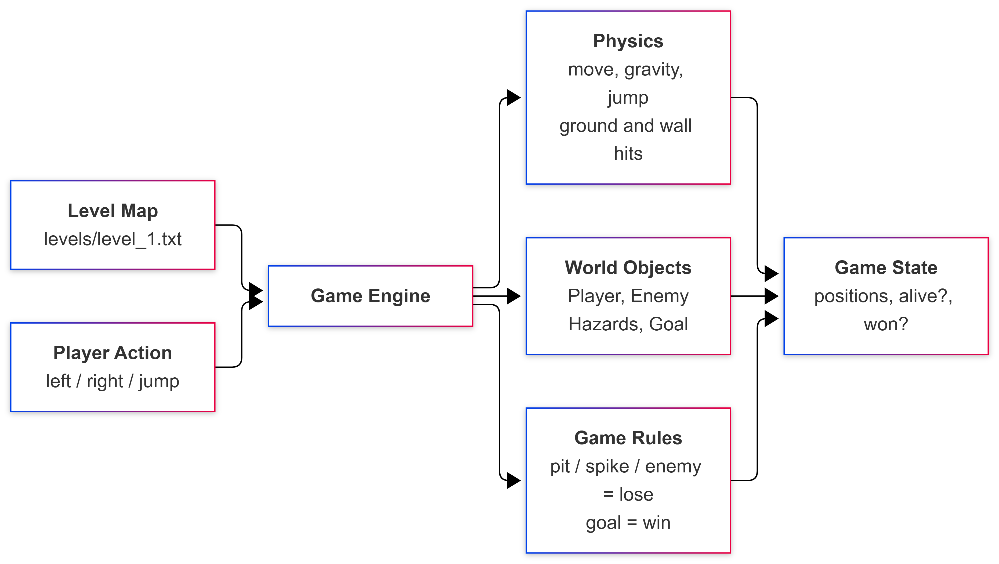

# Design decisions

## Goal
Custom Mario-style platformer + Gymnasium environment + PPO agent that outperforms a random-action baseline.

## Architecture
High-level game structure:



The engine takes the level map and a player action, runs physics and game rules on world objects, and updates the game state. `MarioEnv` wraps the engine with the Gymnasium `reset` / `step` API.

## Game rules (Level 1)
- Solid ground and walls from `#` tiles (brown)
- Gaps / pits: falling below the map ends the episode (death)
- One patrol enemy (`E`, pink/purple): touching it ends the episode (death)
- Spikes (`^`, red) sit on the path above solid ground — walk into = death; jump over
- Extra air rows under the ceiling so jumps have vertical room
- Goal (`G`, green): reaching it ends the episode successfully
- Player is drawn yellow in the RGB/pygame view
- `GameEngine.reset(seed)` restores a clean start; same seed + same actions replay the same trajectory

## Observation
Hand-crafted feature vector (`OBS_DIM = 10`, `float32`), built in `src/mario_rl/env/observations.py`:

| Index | Feature |
|------:|---------|
| 0 | player x (normalized by map width) |
| 1 | player y (normalized by map height) |
| 2 | player vx (normalized by max move speed) |
| 3 | player vy (normalized by max fall speed) |
| 4 | on_ground (0 or 1) |
| 5 | goal dx (normalized) |
| 6 | goal dy (normalized) |
| 7 | nearest enemy dx (normalized; 0 if none) |
| 8 | nearest enemy dy (normalized; 0 if none) |
| 9 | ground ahead to the right (0 or 1) |

## Action space (discrete)
- 0: NOOP
- 1: LEFT
- 2: RIGHT
- 3: JUMP
- 4: RIGHT+JUMP

## Reward
Default progress-shaped reward in `src/mario_rl/env/rewards.py`:
- `+0.12 * (x_t - x_{t-1})` for horizontal progress
- `-0.01` time penalty each step
- `+10` on reaching the goal
- `-1.5` on death

## Episode end
- terminated: death or goal reached
- truncated: maximum step limit reached (`max_episode_steps`, default 2000)

## Determinism
The same seed and action sequence must produce the same trajectory.

## Rendering
- headless mode for training (`render_mode=None`) — **required path for Core**
- ASCII snapshot script for quick physics/gameplay checks
- RGB tile renderer + GIF recording: `scripts/record_demo.py` → `results/demos/best_agent.gif`
- Learning curves: `scripts/plot_learning_curves.py` → `results/plots/`
- Optional keyboard play window: `scripts/play_human.py` (pygame; training stays headless)

## Random baseline (Level 1)
Command:

```bash
python scripts/evaluate.py --agent random --episodes 30 --seed 42
```

Recorded summary (`results/metrics/random_baseline_latest.json`):
- episodes: 30
- mean return: 7.84
- mean x progress: 93.49
- success rate: 0.00
- death rate: 1.00

This is the reference the PPO agent must beat.

## PPO training (Day 6)

- Library: **Stable-Baselines3** `PPO` with `MlpPolicy` (PyTorch backend)
- Config: `configs/default.yaml` (`total_timesteps`, learning rate, `n_steps`, …)
- Train: `python scripts/train.py` (or `--timesteps N` for a shorter run)
- Saves: `models/ppo_mario_level1.zip`, `models/ppo_mario_level1_latest.zip`, plus meta JSON
- Evaluate: `python scripts/evaluate.py --agent ppo --model models/ppo_mario_level1_latest.zip`
- ASCII policy demo: `python scripts/demo_ascii.py --agent ppo`


